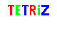
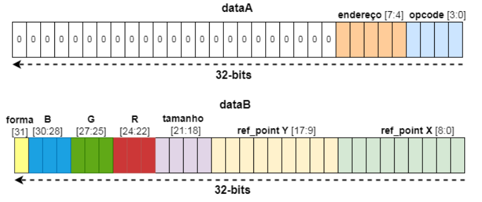
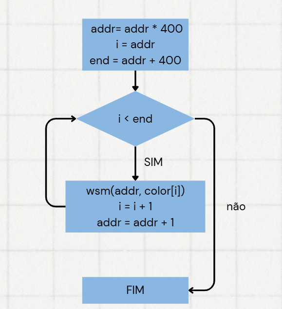
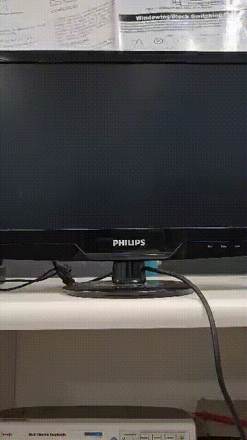
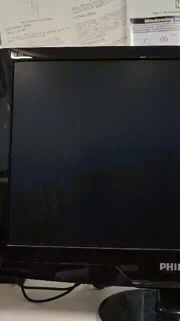
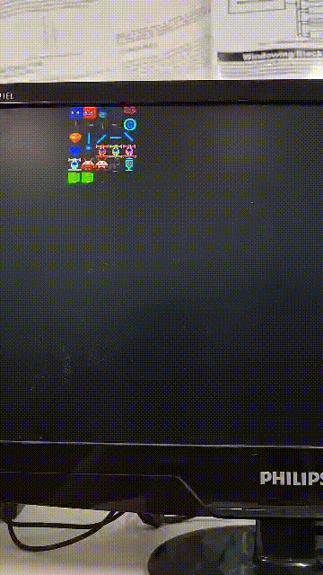
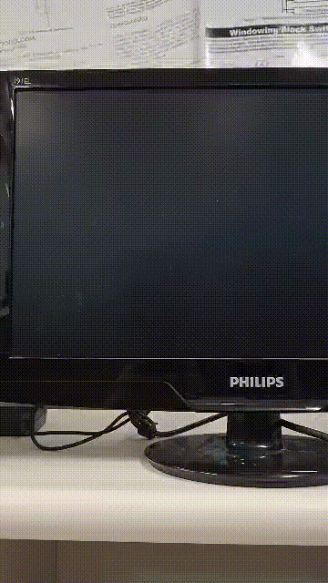
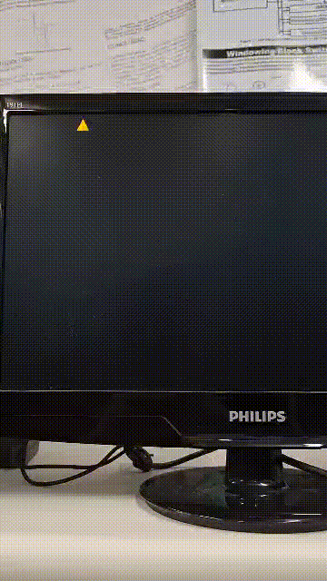
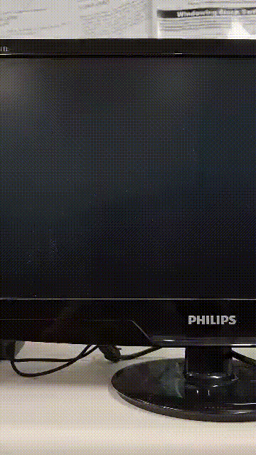
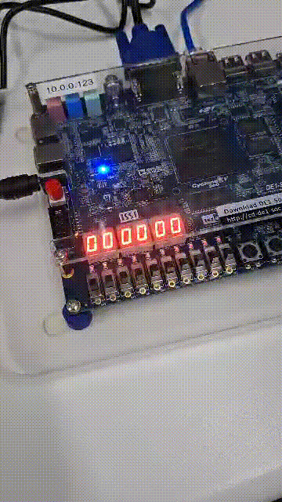

<p align="center">
  
</p>

# Sumário

- [Geral](#geral)

## Geral:
Este projeto trata-se do desenvolvimento de uma biblioteca com funções gráficas para a GPU projetada e implementada por Gabriel Sá Barreto no kit de desenvolvimento DE1-SoC. Para realização do projeto, foi necessário aprender como a GPU funciona, como realizar a comunicação entre o HPS e a FPGA, e adaptar o jogo [Tetriz](https://github.com/vini464/TETRIS_ON_DE1-SOC) para a nova plataforma.

## Requisitos:

A biblioteca produzida teve que cumprir os seguintes requisitos:

- Conter todas as funções do processador gráfico, são elas:
    - Desenhar sprites na tela;
    - Modificar/Inserir sprites na memória da GPU;
    - Mudar a cor base do background;
    - Desenhar quadrados de tamanho fixo (8x8 pixels) na tela;
    - Desenhar polígonos (quadrados ou triângulos) de tamanhos variáveis na tela.
- Todo o código da biblioteca deverá ser escrito na linguagem assembly.
- Implementar a parte gráfica do jogo [Tetriz](https://github.com/vini464/TETRIS_ON_DE1-SOC) utilizando a biblioteca desenvolvida.

## Biblioteca:

Como produto final, temos uma biblioteca com as seguintes funções:
```
// Mapeia a memória, necessário para executar qualquer uma das funções abaixo
void gpu_open();
// Desmapeia a memória
void gpu_close();
// Pinta o background com a cor inserida sendo valor máximo 511
void wbr_bg(u_short color);
// Desenha um sprite salvo na memória.
void wbr_sp(u_short act, u_short posx, u_short posy, u_short offset, u_short reg);
// Escreve um bloco no background da cor escolhida
void wbm(u_short bgr, u_short address);
// Salva um pixel de um sprite na memória
void wsm(u_short spr_address, u_short bgr);
// salva um sprite inteiro na memória
void save_sprite(u_short pixel_vector[400], u_short offset);
// desenha um triangulo na tela
void dp_triangle(u_short bgr, u_short size, u_short refPosY, u_short refPosX, u_short reg);
// desenha um quadrado na tela
void dp_square(u_short bgr, u_short size, u_short refPosY, u_short refPosX, u_short reg);
// Mostra um número no display de 7 segmentos
void set_hex(u_short d5_d4, int d3_d2_d1_d0);
// Lê qual botão foi pressionado
int read_keys();
```

Todas as funções que são instruções da GPU funcionam de forma muito semelhante, onde os dados a serem armazenados e/ou modificados são passados para o buffer `Data_B`, já o opcode junto com o endereço de memória, ou registrador, são enviados para o buffer `Data_A`, após isso é o sinal wrfull é checado até que seja igual a 0, por fim é enviado um pulso para wrreg permitindo a escrita. Esse processo se repete para as funções `wbr_bg`, `wbr_sp`, `wbm`, `wsm`, `dp_triangle` e `dp_square`. 
- Exemplo de como uma instrução é enviada para a GPU:


As funções `gpu_open` e `gpu_close` são utilizadas para mapear e desampear a memória, respectivamente. Elas são necessárias para que possamos escrever nos buffers `Data_A` e `Data_B`, nos endereços dos displays de 7 segmentos, e ler do endereço dos botões.

A função `save_sprite` foi implementada para facilitar a inserção de novos sprites na memória. O fluxograma a seguir descreve seu comportamento:



Por fim temos as funções `read_keys` e `set_hex`, a primeira é usada para identificar quais dos botões estão pressionados (retornando um numero de 4 bits onde 0 -> pressionado e 1 -> não pressioado). Já a segunda função manda um número de 8 bits para cada display de 7 segmentos, onde 1 indica que é para apagar e 0 acender cada segmento. 


### Tetriz

Para o jogo funcionar neste novo hardware, algumas alterações foram realizadas. Em resumo: onde chamávamos as funções da biblioteca `intelfpgaup` nós agora chamamos as funções que desenvolvemos.

# Como executar

Para rodarmos o código, precisamos cumprir alguns requisitos que são:

1. Uma Placa DE1-SoC com a GPU de Gabriel Sá Barreto instalada.
2. Linux instalados.
3. A biblioteca do IntelFPGAUP Accelerometer instalada.
4. Um monitor com entrada VGA.
5. Um cabo de Ethernet
6. Um computador com terminal para acessar a placa via protocolo SSH.

Com todos os requisitos cumpridos basta transferir os arquivos desse repositório para a placa. E então entrar na pasta do projeto e rodar o comando `make run_game`. Se você quiser apenas testar o jogo deve rodar o comando `make jarvis`.

Caso sua placa tenha acesso a internet, e o git instalado, você pode digitar o seguinte comando: 
Clone o repositório:
```
git clone https://github.com/vini464/GPU_LIB.git && cd GPU_LIB
make run_game 
```
ou
```
git clone https://github.com/vini464/GPU_LIB.git && cd GPU_LIB
make jarvis 
```

> **Obs: Você precisa de privilégio de administrador para rodar o jogo.**

# Testes

Para reproduzir os testes você precisará do script jarvis.c.

### Teste de BackGround

Esse teste consiste em chamar a função wbr_bg e definir uma cor para ser mostrada, seu resultado deve se parecer com isso:

<p align="center">
  
</p>

### Teste de Sprite

Esse teste consiste em chamar a função para colocar todos os sprites na tela, o seu resultado deve se parecer com isso:

<p align="center">
  
</p>

### Teste de Adicionar Sprite

Esse teste consiste em adicionar um sprite de uma cobra pre-feita na placa, o seu resultado deve se parecer com isso:

<p align="center">
  
</p>

### Teste de Triangulo e Quadrado

Esse teste consiste em desenhar um triangulo e um quadrado na tela, caso passe paramentros errados, a GPU tentará printar e resultará em uma imagem parecendo um "post-it", caso coloque parametros validos, o resultado será esse:

<p align="center">
  
  
</p>

### Teste de Background Block

Esse teste consiste em desenhar um background block na tela, o seu resultado deve se parecer com isso:

<p align="center">
  
</p>

### Teste de 7 Segmentos

Esse teste consiste em passar um número para o 7 segmentos e após isso, deve ser impresso esse número no 7 segmentos:

<p align="center">
  
</p>

### Teste de Botão

Esse teste consiste em ficar continuamente lendo a palavra que está associada aos botões, cada botão pode somar +1,+2,+4,+8 na exibição enquanto estiver sendo pressionado, o seu resultado deve se parecer com isso:

<p align="center">
  
</p>

# Tecnologias utilizadas:

Para o desenvolvimento desse projeto, utilizamos as seguintes tecnologias e ferramentas:

Editores de texto:


Linguagem:


Ferramentas auxiliares:


# Conclusão

Foi desenvolvido toda a biblioteca para uso da GPU com todos os comandos em Assembly, portanto, os principais objetivos do PBL que eram, conseguir entender como funciona a GPU de Gabriel Sá Barreto e obter experiencia com códigos em Assembly ARM foi conquistado tendo em vista o sucesso do desenvolvimento do problema.


