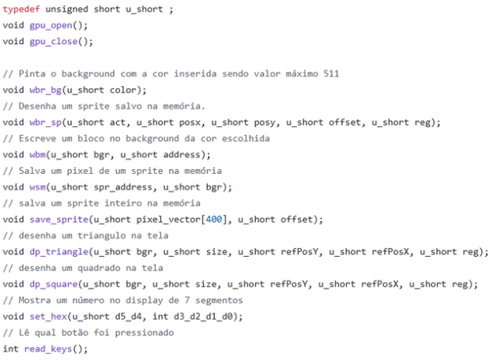

# Logo
# Sumario

# Geral
Nesse projeto foi desenvolvido uma biblioteca em assembly ARMv7 para a utilização da GPU desenvolvida por Gabriel Sá Barreto, para o seu desenvolvimento foi necessario aparender sobre como a GPU funciona, como se comunicar com ela e utilizar ela em Assembly ARMv7, e adaptar o jogo de Tetriz desenvolvido no problema anterior para a nova plataforma.

# Requisitos

A biblioteca produzida teve que cumprir os seguintes requisitos:

- [x] Desenhar sprites 20x20 na tela
- [x] Definir a cor base do background
- [x] Modificar os sprites armazenados na memoria
- [x] Desenhar quadrados e triangulos 20x20 até 160x160 aumentando numa escala de 10x10
- [x] Pintar quadrados 8x8 na tela
- [x] Limpar a tela
- [x] Printar telas inteiras

Além dos seguintes requisitos, foi solicitado que as instruções fossem feitas em Assembly e extendem-se para C.

# Desenvolvimento

# Assembly

O processador consiste num 800MHz Dual-core ARM Cortex-A9 MPCore processor com Assembly ARMv7, e foi desenvolvido nele as seguintes funções em Assembly:



Vale lembrar que todas as funções após iniciarem a sua execução salvam o contexto dos registradores utilizados para sua execução e restauram esse contexto logo antes do retorno da função para evitar conflitos na execução do problema.

As funções que são instruções da GPU funcionam todas de forma muito semelhante onde os parametros são passados para o buffer Data_B e o opcode e endereço de memoria são enviados para o buffer Data_A, após isso elas aguardam poderem escrever checkando a variavel wrfull == 0 e é enviado um pulso para wrreg permitindo a escrita. Esse processo se repete para as funções wbr_bg, wbr_sp, wbm, wsm, dp_triangle e dp_square

# C

Em C foram desenvolvidos algumas funções ** Fala aqui sobre C Everton **

# Tetriz

** Fala aqui sobre o que precisou enfiar pro jogo funcionar **

# Como executar

Para rodarmos o código, precisamos cumprir alguns requisitos que são:

1. Uma Placa DE1-SoC com a GPU de Gabriel Sá Barreto instalada.
2. Linux instalados.
3. A biblioteca do IntelFPGAUP Accelerometer instalada.
4. Um monitor com entrada VGA.
5. Um cabo de Ethernet
6. Um computador com terminal para acessar a placa via protocolo SSH.

Com todos os requisitos cumpridos basta transferir os arquivos desse repositório para a placa. E então entrar na pasta do projeto e rodar o comando `make game`.

Caso sua placa tenha acesso a internet, e o git instalado, você pode digitar o seguinte comando: 
Clone o repositório:
```
git clone https://github.com/vini464/GPU_LIB.git && cd GPU_LIB
make game
```
> **Obs: Você precisa de privilégio de administrador para rodar o jogo.**


# Testes

Para reproduzir os testes você precisará do script jarvis.c.

### Teste de BackGround

Esse teste consiste em chamar a função wbr_bg e definir uma cor para ser mostrada, seu resultado deve se parecer com isso:

<p align="center">
  
</p>

### Teste de Sprite

Esse teste consiste em chamar a função para colocar todos os sprites na tela, o seu resultado deve se parecer com isso:

<p align="center">
  
</p>

### Teste de Adicionar Sprite

Esse teste consiste em adicionar um sprite de uma cobra pre-feita na placa, o seu resultado deve se parecer com isso:

<p align="center">
  
</p>

### Teste de Triangulo e Quadrado

Esse teste consiste em desenhar um triangulo e um quadrado na tela, caso passe paramentros errados, a GPU tentará printar e resultará em uma imagem parecendo um "post-it", caso coloque parametros validos, o resultado será esse:

<p align="center">
  
</p>

<p align="center">
  
</p>

### Teste de Background Block

Esse teste consiste em desenhar um background block na tela, o seu resultado deve se parecer com isso:

<p align="center">
  
</p>

### Teste de 7 Segmentos

Esse teste consiste em passar um número para o 7 segmentos e após isso, deve ser impresso esse número no 7 segmentos:

<p align="center">
  
</p>

### Teste de Botão

Esse teste consiste em ficar continuamente lendo a palavra que está associada aos botões, cada botão pode somar +1,+2,+4,+8 na exibição enquanto estiver sendo pressionado, o seu resultado deve se parecer com isso:

<p align="center">
  
</p>

# Tecnologias utilizadas:

Para o desenvolvimento desse projeto, utilizamos as seguintes tecnologias e ferramentas:

Editores de texto:


Linguagem:


Sistema Operacional:


Ferramentas auxiliares:


Ferrak

# Conclusão

Foi desenvolvido toda a biblioteca para uso da GPU com todos os comandos em Assembly e mais algumas funções em C, portanto, os principais objetivos do PBL que eram conseguirmos entender como funciona a GPU de Gabriel Sá Barreto e aprendermos e obtermos experiencia com códigos em Assembly ARM foi conquistado tendo em vista o sucesso do desenvolvimento do problema.


